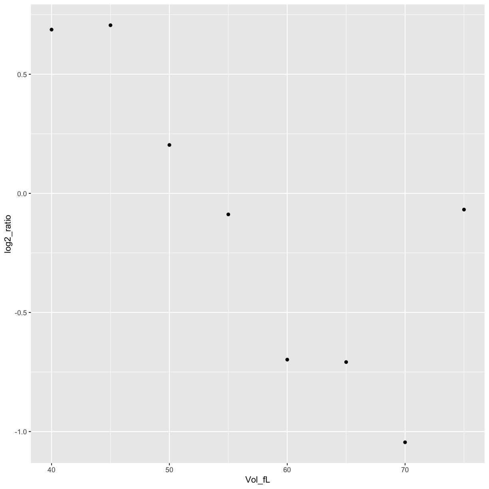
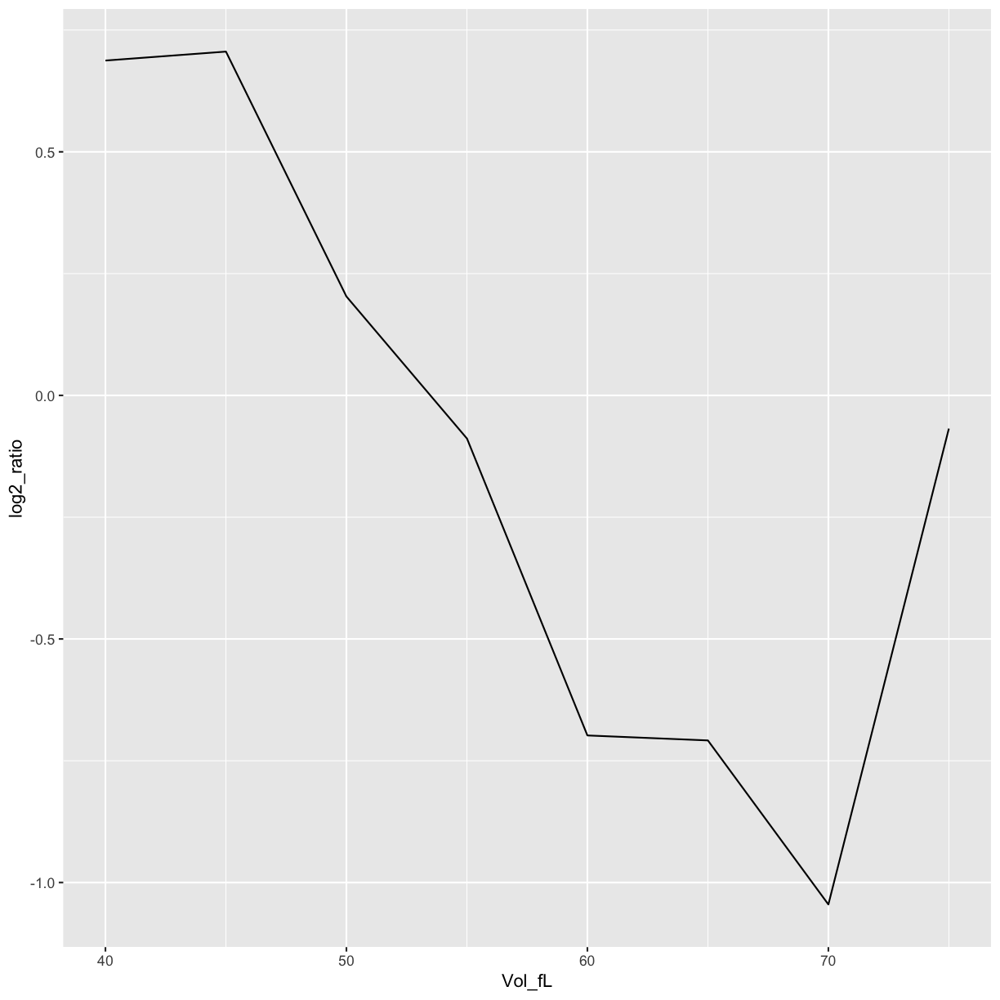
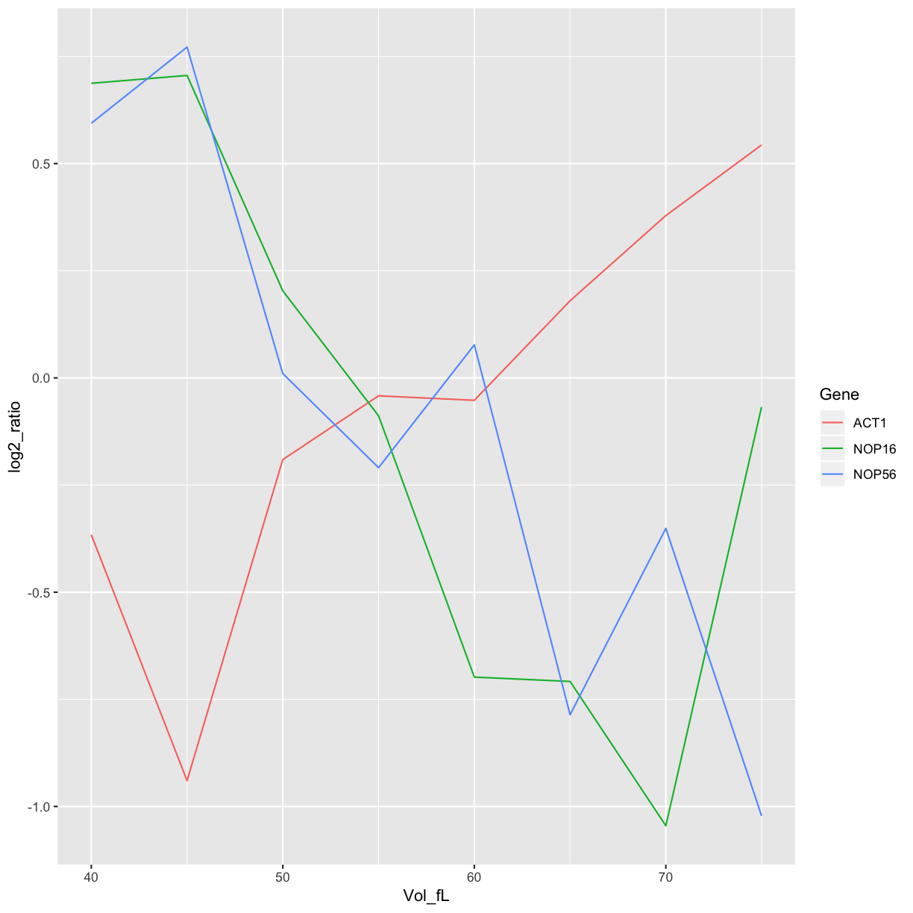
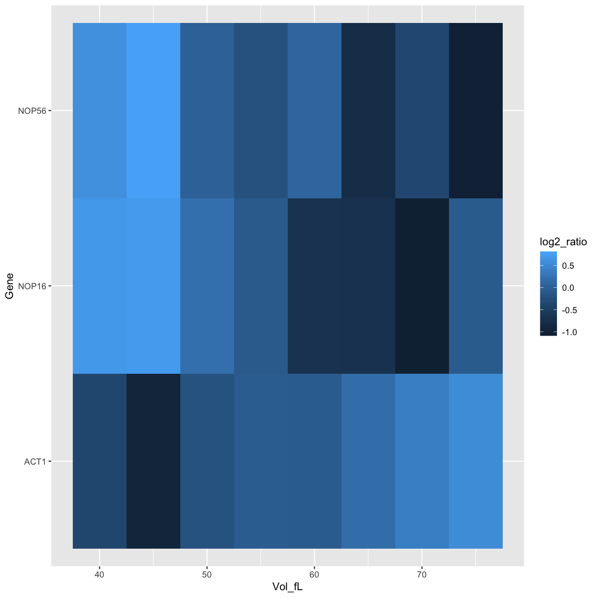
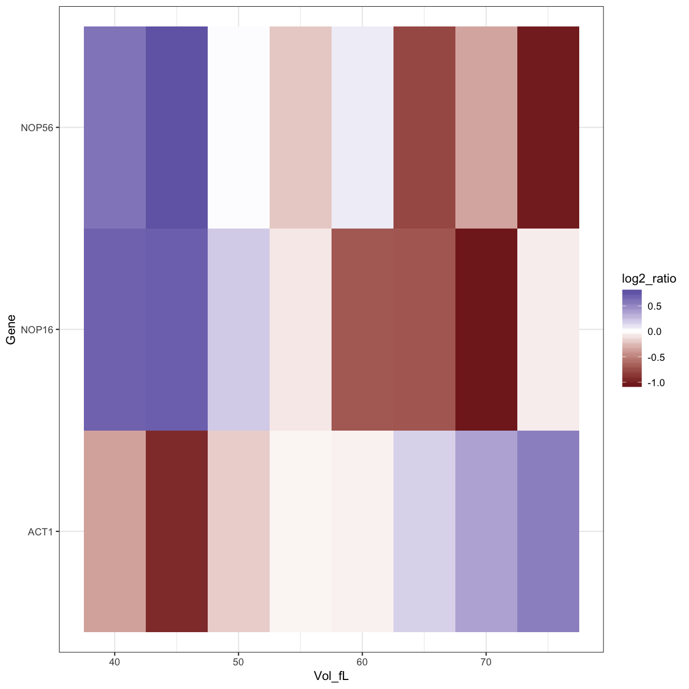

---
# Please do not edit this file directly; it is auto generated.
# Instead, please edit 03-reshaping-data.md in _episodes_rmd/
title: "Reshaping and Plotting data"
author: "Data Carpentry contributors"
minutes: 20
---

------------

> ### Learning Objectives
>
> * Reshape a tibble
> * Start with ggplot2

------------

## Our biological question: can we see the behaviour of our favourite genes?

* Plot the individual trajectories of favourites: NOP16, NOP56, ACT1

## Reshape/tidy the data

~~~
gather(mRNA_data,key=Vol,value="log2_ratio",-Name,-Gene)
~~~
{: .language-r}

~~~
# A tibble: 53,704 x 4
   Name  Gene      Vol   log2_ratio
   <chr> <chr>     <chr>      <dbl>
 1 Q0010 <NA>      40 fL      0.145
 2 Q0017 <NA>      40 fL     -1.32 
 3 Q0032 <NA>      40 fL     NA    
 4 Q0045 COX1      40 fL      0.252
 5 Q0050 AI1       40 fL     -0.784
 6 Q0055 AI2       40 fL     -0.369
 7 Q0060 AI3       40 fL     -0.143
 8 Q0065 AI4       40 fL     -0.377
 9 Q0070 AI5_ALPHA 40 fL     -0.439
10 Q0075 AI5_BETA  40 fL     -0.450
# ... with 53,694 more rows
~~~
{: .output}

~~~
mRNA_data_gathered <- 
gather(mRNA_data,key=Vol,value="log2_ratio",-Name,-Gene) %>%
    separate(Vol,into="Vol_fL") %>%
    mutate(Vol_fL = as.numeric(Vol_fL))
~~~
{: .language-r}

~~~
Warning: Expected 1 pieces. Additional pieces discarded in 53704 rows [1,
2, 3, 4, 5, 6, 7, 8, 9, 10, 11, 12, 13, 14, 15, 16, 17, 18, 19, 20, ...].
~~~
{: .error}

~~~
mRNA_data_gathered
~~~
{: .language-r}

~~~
# A tibble: 53,704 x 4
   Name  Gene      Vol_fL log2_ratio
   <chr> <chr>      <dbl>      <dbl>
 1 Q0010 <NA>          40      0.145
 2 Q0017 <NA>          40     -1.32 
 3 Q0032 <NA>          40     NA    
 4 Q0045 COX1          40      0.252
 5 Q0050 AI1           40     -0.784
 6 Q0055 AI2           40     -0.369
 7 Q0060 AI3           40     -0.143
 8 Q0065 AI4           40     -0.377
 9 Q0070 AI5_ALPHA     40     -0.439
10 Q0075 AI5_BETA      40     -0.450
# ... with 53,694 more rows
~~~
{: .output}

~~~
mRNA_data_NOP16 <- filter(mRNA_data_gathered, Gene=="NOP16")
mRNA_data_NOP16
~~~
{: .language-r}

~~~
# A tibble: 8 x 4
  Name    Gene  Vol_fL log2_ratio
  <chr>   <chr>  <dbl>      <dbl>
1 YER002W NOP16     40     0.687 
2 YER002W NOP16     45     0.706 
3 YER002W NOP16     50     0.203 
4 YER002W NOP16     55    -0.0884
5 YER002W NOP16     60    -0.698 
6 YER002W NOP16     65    -0.708 
7 YER002W NOP16     70    -1.05  
8 YER002W NOP16     75    -0.0681
~~~
{: .output}

## Plot NOP16 data

~~~
ggplot(data=mRNA_data_NOP16, aes(x=Vol_fL,y=log2_ratio)) +
    geom_point()
~~~
{: .language-r}

~~~
ggplot(data=mRNA_data_NOP16, aes(x=Vol_fL,y=log2_ratio)) +
    geom_line()
~~~
{: .language-r}

## Plot all the favourite genes data

~~~
mRNA_data_3genes <- filter(mRNA_data_gathered, Gene %in% c("ACT1","NOP16","NOP56"))

ggplot(data=mRNA_data_3genes, aes(x=Vol_fL,y=log2_ratio,colour=Gene)) +
    geom_line()
~~~
{: .language-r}

~~~
ggplot(data=mRNA_data_3genes, aes(x=Vol_fL,y=Gene,fill=log2_ratio)) +
    geom_tile()
~~~
{: .language-r}

~~~
ggplot(data=mRNA_data_3genes, aes(x=Vol_fL,y=Gene,fill=log2_ratio)) +
    geom_tile() +
    scale_fill_gradient2()
~~~
{: .language-r}

## How to make the plot look nice

~~~
ggplot(data=mRNA_data_3genes, aes(x=Vol_fL,y=Gene,fill=log2_ratio)) +
    geom_tile() +
    scale_fill_gradient2() + 
    theme_bw()
~~~
{: .language-r}

> ## Challenge: 
>
> 1. Plot your other favourite genes. NOP6?
> 2. Can you change the line colours to something nicer?
>
> > ## Solution
> >
> > 
> > ~~~
> > mRNA_data_4genes <- filter(mRNA_data_gathered, Gene %in% c("ACT1","NOP16","NOP56","NOP6"))
> > # ?scale_colour_brewer
> > ~~~
> > {: .language-r}
> {: .solution}
{: .challenge}


