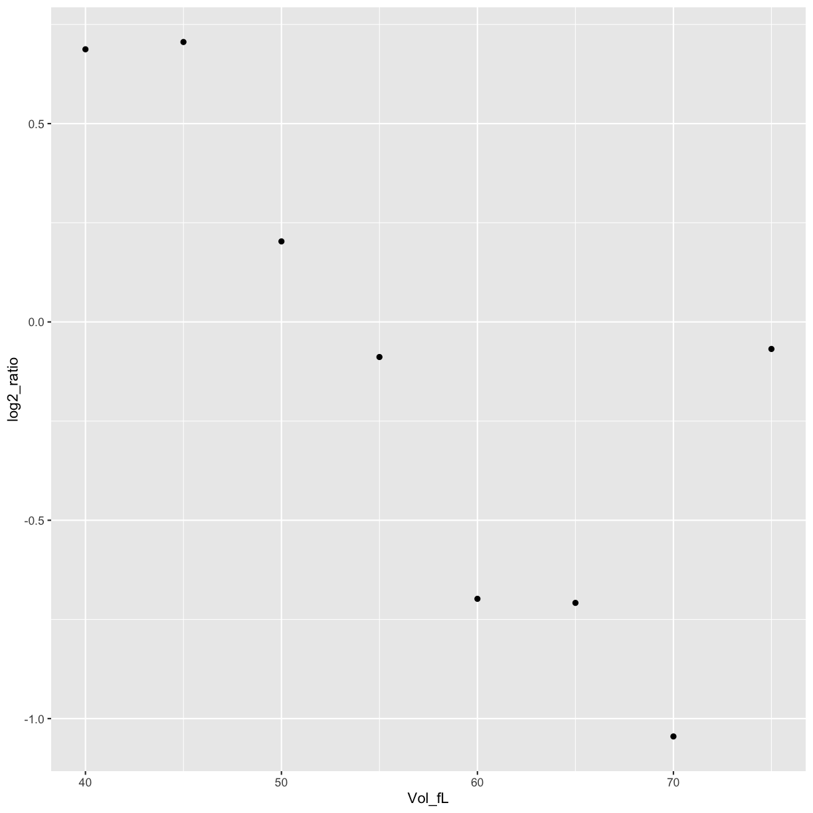
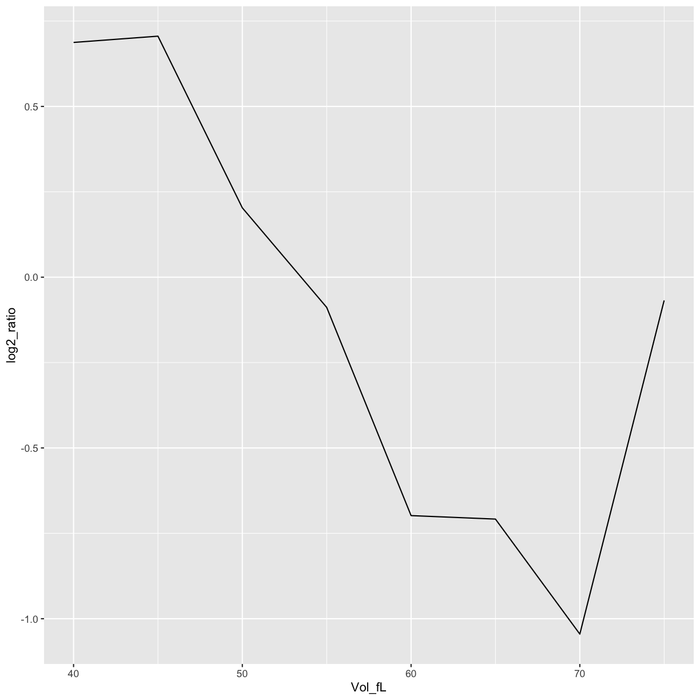
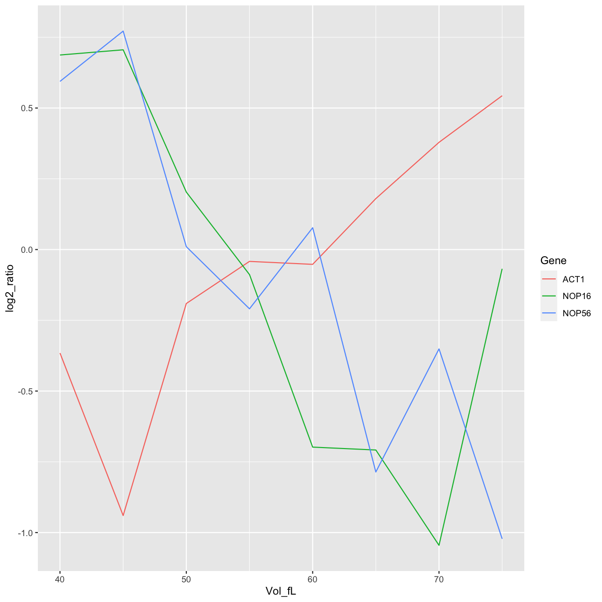
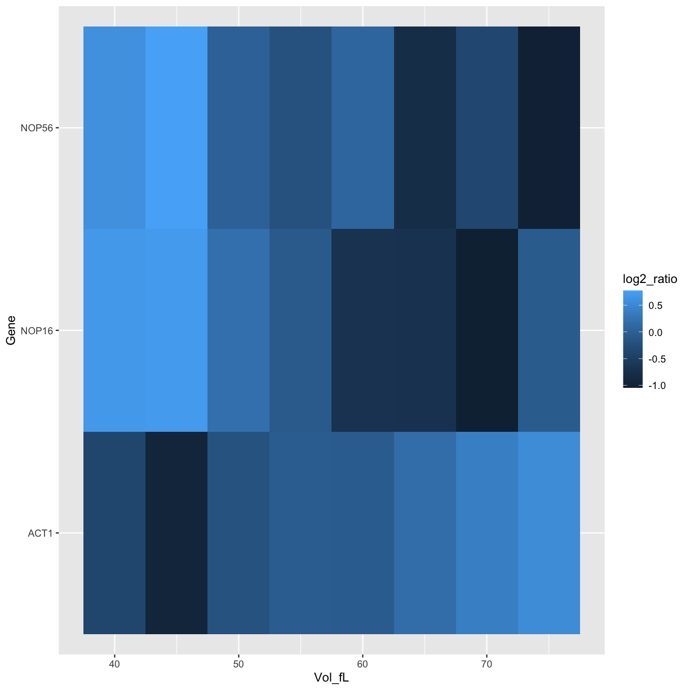
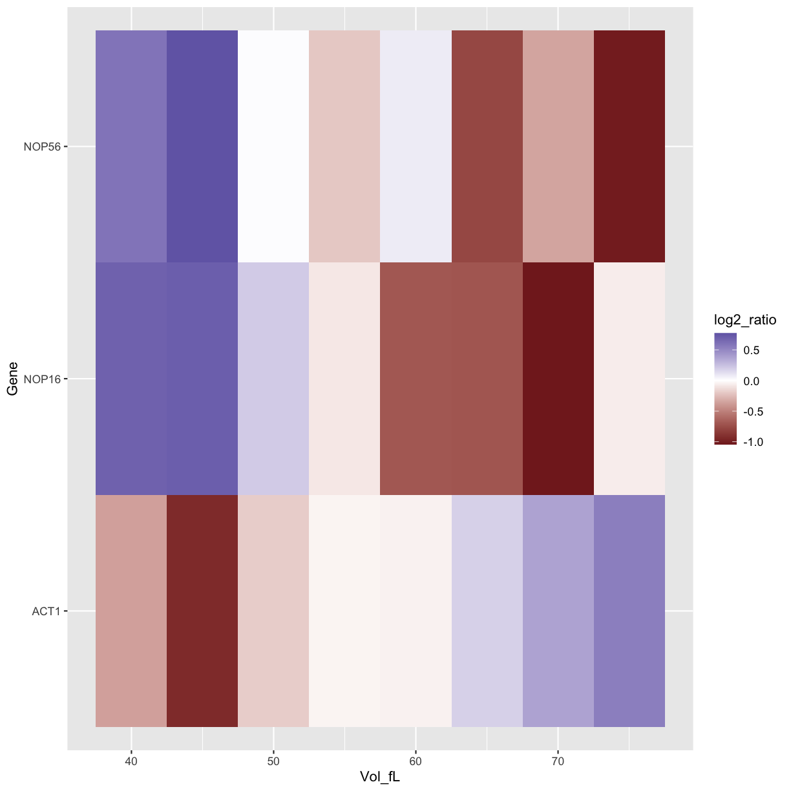
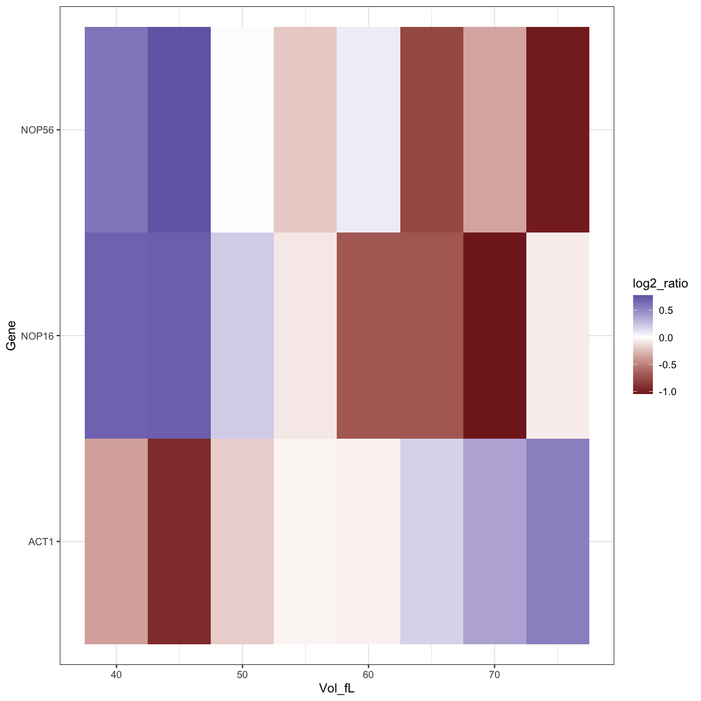

---
# Please do not edit this file directly; it is auto generated.
# Instead, please edit 04-ggplotting-data.md in _episodes_rmd/
title: "Plotting data with ggplot2"
author: "Data Carpentry contributors"
teaching: 60
exercises: 30
objectives:
- "Understand how plots are built by mapping data values to aesthetics"
- "Plot a line plot and heat map from the same data, using ggplot2"

keypoints:
- "Plots are built from mapping data values to position, colour, and other aesthetics."
- "Nice plotting relies on tidy data."
- "The same data can be usefully plotted in different ways."
source: Rmd
---

------------

> ### Learning Objectives
>
> * Reshape a tibble
> * Start with ggplot2

------------

## Our biological question: can we see the behaviour of our favourite genes?

* Plot the individual trajectories of favourite genes: NOP16, NOP56, ACT1.
* See how different plotting methods bring out different features of the data.

## Filter only data for NOP16

~~~
mRNA_data_NOP16 <- filter(mRNA_data_tidy, Gene=="NOP16")
mRNA_data_NOP16
~~~
{: .language-r}

~~~
# A tibble: 8 x 4
  SystematicName Gene  Vol_fL log2_ratio
  <chr>          <chr>  <dbl>      <dbl>
1 YER002W        NOP16     40     0.687 
2 YER002W        NOP16     45     0.706 
3 YER002W        NOP16     50     0.203 
4 YER002W        NOP16     55    -0.0884
5 YER002W        NOP16     60    -0.698 
6 YER002W        NOP16     65    -0.708 
7 YER002W        NOP16     70    -1.05  
8 YER002W        NOP16     75    -0.0681
~~~
{: .output}

## Plot NOP16 data

Plot only as points.

~~~
ggplot(data=mRNA_data_NOP16, aes(x=Vol_fL,y=log2_ratio)) +
    geom_point()
~~~
{: .language-r}

Plot as a connected line.

~~~
ggplot(data=mRNA_data_NOP16, aes(x=Vol_fL,y=log2_ratio)) +
    geom_line()
~~~
{: .language-r}

## Plot all the favourite genes data

~~~
mRNA_data_3genes <- filter(mRNA_data_tidy, Gene %in% c("ACT1","NOP16","NOP56"))

ggplot(data=mRNA_data_3genes, aes(x=Vol_fL,y=log2_ratio,colour=Gene)) +
    geom_line()
~~~
{: .language-r}

~~~
ggplot(data=mRNA_data_3genes, aes(x=Vol_fL,y=Gene,fill=log2_ratio)) +
    geom_tile()
~~~
{: .language-r}

~~~
ggplot(data=mRNA_data_3genes, aes(x=Vol_fL,y=Gene,fill=log2_ratio)) +
    geom_tile() +
    scale_fill_gradient2()
~~~
{: .language-r}

## How to make the plot look nice

~~~
ggplot(data=mRNA_data_3genes, aes(x=Vol_fL,y=Gene,fill=log2_ratio)) +
    geom_tile() +
    scale_fill_gradient2() + 
    theme_bw()
~~~
{: .language-r}

> ## Challenge: 
>
> 1. Plot your other favourite genes. NOP6?
> 2. Can you change the line colours to something nicer?
>
> > ## Solution
> >
> > 
> > ~~~
> > mRNA_data_4genes <- filter(mRNA_data_tidy, Gene %in% c("ACT1","NOP16","NOP56","NOP6"))
> > # ?scale_colour_brewer
> > ~~~
> > {: .language-r}
> {: .solution}
{: .challenge}



