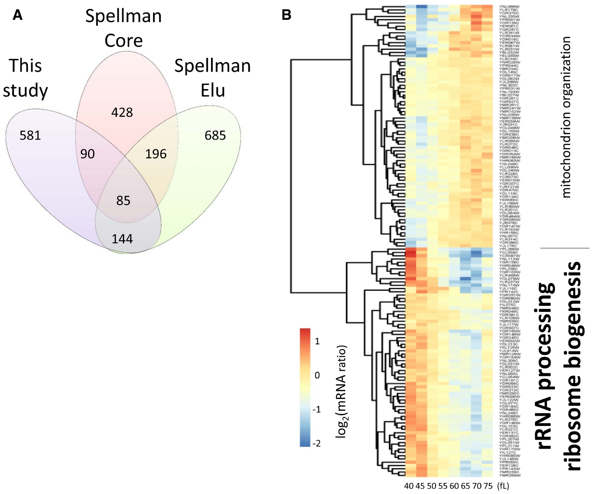

```{r, echo=FALSE}
source("../bin/chunk-options.R")
```


<!-- TODO: replace keypoints and objectives as content added -->

<!-- Removed from keypoints: - "Use `mutate()` to create new variables." -->
<!-- Removed from keypoints: - "Use `group_by()` and `summarize()` to work with subsets of data." -->
<!-- Removed from keypoints: - "Reshape data using dplyr functions." -->

<!-- Removed from objectives: - "Add new columns to a data frame that are functions of existing columns with `mutate`." -->
<!-- Removed from objectives: - "Use the split-apply-combine concept for data analysis." -->
<!-- Removed from objectives: - "Use `summarize`, `group_by`, and `count` to split a data frame into groups of observations, apply summary statistics for each group, and then combine the results." -->
<!-- Removed from objectives: - "Employ the ‘split-apply-combine’ concept to split the data into groups, apply analysis to each group, and combine the results." -->

## Our biological question: do our favourite genes change expression in this dataset?

This workshop is based around a common situation in transcriptomics. We are 
interested in a group of genes, and another study has measured expression in 
conditions where expression of these genes might be interesting. Can we tell if 
our favourite genes have changing expression?

Here the dataset is of cell cycle progression in the yeast *Saccharomyces cerevisiae*, 
from this paper: *Translational control of lipogenic enzymes in the 
cell cycle of synchronous, growing yeast cells.* Blank et al. 2017 
https://doi.org/10.15252/embj.201695050.



In Figure 2, the paper notes that ribosome biogenesis genes are periodically 
expressed during the cell cycle, but doesn't tell us which ones. 

**Can we find if our favourite gene is indeed periodically expressed?** 

So our data analysis goals are:

* Find which ribosome biogenesis genes are on the list in figure 2
* Is our favourite gene NOP56 (fibrillarin, required for assembly of the 60S 
ribosomal sub-unit!) periodically expressed?

In another lesson, we will then carry on using this data to: 

* Recreate figure 2 so we can read the gene names.

These goals teach common tasks in analysing tabular data:

* compare two tables, to find which elements are in both tables (here, genes)
* extract/filter a small portion of a large dataset for closer inspection
* use two different names for related objects (here, systematic ORF IDs and gene names)

This last point is extremely common in bioinformatics, where there are entrez gene IDs, uniprot protein IDs, etc. Often "in the wild" we need to take one set of data labeled with one ID, and compare it to another set of data labeled with a different ID. Tools in R and the tidyverse can help with that.

# Data Manipulation using **tidyverse**

Packages in R are basically sets of additional functions that let you do more
stuff. The functions we've been using so far, like `str()`,
come built into R; packages give you access to more of them. Before you use a
package for the first time you need to install it on your machine, and then you
should import it in every subsequent R session when you need it. You should
already have installed the **`tidyverse`** package. This is an
"umbrella-package" that installs several packages useful for data analysis which
work together well such as **`readr`**, **`tidyr`**, **`dplyr`**, **`ggplot2`**, 
**`tibble`**, etc.

The **`tidyverse`** package tries to address 3 common issues that arise when
doing data analysis with some of the functions that come with R:

1. The results from a base R function sometimes depend on the type of data.
2. Using R expressions in a non standard way, which can be confusing for new
   learners.
3. Hidden arguments, having default operations that new learners are not aware
   of.

To load the package type:

```{r, message = FALSE, purl = FALSE}
## load the tidyverse packages, incl. dplyr
library("tidyverse")
```

## What are **`readr`**, **`dplyr`** and **`tidyr`**?

We'll read in our data using `read_lines()` and `read_tsv()` functions, from the 
tidyverse package **`readr`**.

The package **`dplyr`** provides easy tools for the most common data manipulation
tasks. It is built to work directly with data frames, with many common tasks
optimized by being written in a compiled language (C++). An additional feature 
is the ability to work directly with data stored in an external database. The 
benefits of doing this are that the data can be managed natively in a relational 
database, queries can be conducted on that database, and only the results of the 
query are returned.

This addresses a common problem with R in that all operations are conducted
in-memory and thus the amount of data you can work with is limited by available
memory. The database connections essentially remove that limitation in that you
can connect to a database of many hundreds of GB, conduct queries on it directly,
and pull back into R only what you need for analysis.

The package **`tidyr`** addresses the common problem of wanting to reshape your 
data for plotting and use by different R functions. Sometimes we want data sets 
where we have one row per measurement. Sometimes we want a data frame where each 
measurement type has its own column, and rows are instead more aggregated groups 
- like plots or aquaria. Moving back and forth between these formats is 
non-trivial, and **`tidyr`** gives you tools for this and more sophisticated 
data manipulation.

To learn more about **`dplyr`** and **`tidyr`** after the workshop, you may want 
to check out this [handy data transformation with **`dplyr`** cheatsheet](https://github.com/rstudio/cheatsheets/raw/master/data-transformation.pdf) and this [one about **`tidyr`**](https://github.com/rstudio/cheatsheets/raw/master/data-import.pdf).


## Which ribosome biogenesis genes are in the list?

We need the list from figure 2 of the paper, and a list of ribosomal biogenesis 
(ribi) genes.

### List of genes from figure 2 in the paper

The paper says:

    > * We then used the log2-transformations of these ratio values as input (see Fig 2 and Dataset 1 within the Source Data for this figure; also deposited in GEO:GSE81932).
    > * Heatmap of the mRNA levels of the 144 genes (Dataset 2 within the Source Data for this figure) in common between the “Spellman Elu” and “This study” datasets.

This tells us that there are two sources for the data, one at the journal website 
and the other at NCBI's Gene Expression Omnibus. We can now search GEO:GSE81932, 
and see the website: [https://www.ncbi.nlm.nih.gov/geo/query/acc.cgi?acc=GSE81932](https://www.ncbi.nlm.nih.gov/geo/query/acc.cgi?acc=GSE81932)

And at the bottom, there is `GSE81932_Dataset02.txt.gz`. Let's download that, 
using a function called `read_lines()`.

```{r, eval = FALSE, purl = FALSE}
# get the help page for read_lines()
?read_lines
```

The help tells us about an `n_max` argument that controls how many lines we read. 
This is useful to inspect a file to see what it looks like before getting started. 
These functions can read data directly from online URLs, and automatically deal 
with compressed `.gz` files, which is very useful.

It will be easier if we make the file location an object rather than having to 
type it repeatedly. So let's read the first few lines of the file to check what 
it contains:

```{r, eval = TRUE, purl = TRUE}
# create an object to hold our file location
periodically_expressed_genes_file <- "ftp://ftp.ncbi.nlm.nih.gov/geo/series/GSE81nnn/GSE81932/suppl/GSE81932_Dataset02.txt.gz"

# show the first 10 lines of the file (using the file location object)
read_lines(periodically_expressed_genes_file, n_max = 10)
```
The output looks like a character vector containing gene names, which is what we 
want, so let's load that into an object in our workspace by removing the `n_max` 
argument from our previous `read_lines()` function and assigning it to a name 
for our object ("periodically_expressed_genes").
 
```{r, eval=TRUE, purl=TRUE}
# create a data object by reading the whole file contents in
periodically_expressed_genes <- read_lines(periodically_expressed_genes_file)
```

Now we have the list of genes which were found to be periodically expressed in 
the study.

> ## Challenge:
>
> 1. How many genes are on the list?
> 2. Can you see the last genes in the list?
>
>> ## Solution
>> 1. How many genes are on the list?
>> ```{r, echo=TRUE}
>> length(periodically_expressed_genes)
>> ```
>> 2. Can you see the last genes in the list?
>> ```{r, echo=TRUE}
>> tail(periodically_expressed_genes)
>> ```
> {: .solution}
{: .challenge}


### List of ribosomal biogenesis (ribi) genes.

For this lesson, we will use the list of yeast ribi genes from the
[**Saccharomyces Genome Database (SGD)**](https://www.yeastgenome.org/) Gene Ontology information, which can be found at: [yeastgenome.org/go/GO:0042254](https://www.yeastgenome.org/go/GO:0042254)

Go to the *bottom* of the page for the longer **computational** list, click 
download and place the file in your `data` directory. You'll need to have a 
folder on your machine called "data" where you'll download the file. 

Now we can take a look at it in R. 

We are going to use the tidyverse function `read_tsv()` to read the contents of 
this file into R as a `tibble` (nice data frame) object. Inside the `read_tsv()` 
command, the first entry is a character string with the file name 
("data/ribosome_biogenesis_annotations.txt")

```{r, eval=TRUE, purl=TRUE}

ribi_annotation_file <- "data/ribosome_biogenesis_annotations.txt"

read_lines(ribi_annotation_file, n_max = 10)
```

What does this tell us about the file?  It is a text file, the first few lines 
start with a `!` character, and afterwards the tab-delimited table starts with 
tabs encoded as `\t`.

We can remove the unwanted lines in two ways. We can either skip them:

```{r, eval=TRUE,  purl=FALSE}
read_tsv(ribi_annotation_file, skip = 7)
```

Or we can tell R that the `!` is a comment character, and lines after that 
should be ignored.

```{r, eval=TRUE,  purl=FALSE}
read_tsv(ribi_annotation_file, comment = "!")
```

Because we will need to reuse this data, let's make it into an object.

```{r, eval=TRUE,  purl=FALSE}
ribi_annotation <- read_tsv(ribi_annotation_file, comment = "!")
```

This statement doesn't show any of the data as output because, as you might 
recall, assignments don't display anything. If we want to check that our data 
has been loaded, we can see the contents of the data frame by typing its name: 
`ribi_annotation`, or using the `view()` command.

```{r, eval = FALSE, purl = FALSE}
# view the data object
ribi_annotation

## try also:
View(ribi_annotation)
```

At this point it's also worth checking the structure of our dataset using 
`str()` to find out whether it's what we'd expect, and look at what modes of 
data it contains. 

```{r, eval=TRUE,  purl=FALSE}
# check structure of the data
str(ribi_annotation)
```

Now we have our data in R, we're going to learn how to inspect it more 
thoroughly, and manipulate it using some of the most common **`dplyr`** functions:

- `select()`: subset columns
- `n_distinct()` and `distinct()`: count or filter unique rows
- `filter()`: subset rows on conditions
- `mutate()`: create new columns by using information from other columns
- `group_by()` and `summarize()`: create summary statistics on grouped data
- `arrange()`: sort results
- `count()`: count discrete values

### What's in a name? 

Our `ribi_annotation` object contains a lot of extra information we won't be 
using, but it all relates to what different genes are annotated as, and how 
they relate to other genes.  

Two of the variables in our object (`Gene` and `Gene Systematic Name`) are 
particularly useful when it comes to answering our questions about which genes 
were shown in Figure 2, and whether our 'favourite gene' NOP56 was periodically 
expressed.

`Gene` holds the shorter more familiar Gene Names, while `Gene Systematic Name` 
contains the more 'official' name but is less helpful in telling us what that 
gene actually does. 

We can also see from the results of `str()` that the `Qualifier` field holds 
information on what kind of genes these are.  

Because we've downloaded this set of Gene Ontology records from the page for 
"Ribosome Biogenesis", we might expect that to be the only type of genes we've 
got in this data object, so let's check using the `dplyr::n_distinct()` function 
and the `dplyr::distinct()` function:

```{r, eval = TRUE, purl = TRUE}

# how many (e.g. n) distinct entries for Qualifier?
n_distinct(ribi_annotation$Qualifier)

# show distinct (unique) entries
distinct(ribi_annotation, Qualifier)

```
We can see that the answer to `n_distinct(ribi_annotation$Qualifier)` is 1, 
which is what we thought. We use can `distinct(ribi_annotation, Qualifier)` to 
confirm that, and show us what that unique entry is ("ribosome biogenesis").

NOTE: You may have noticed that the format of these two commands is slightly 
different. For `distinct()`, we've provided TWO arguments (the data object and 
the variable name from that object), while for `n_distinct()` we've only 
provided one (the data object with the variable accessed via the `$` symbol, a 
common way of accessing variables in data frames). You can look at the help 
information for both functions (e.g. `?n_distinct`) to see why this is.  
`n_distinct()` requires a vector of values as its main argument, whereas 
`distinct()` takes a data object (e.g. our tibble / data frames) and can then 
take optional variables to use when determining uniqueness - so here we've 
checked for unique rows from the `Qualifier` column.

Now we want to pull out (select!) just the columns from `ribi_annotation` that 
we're interested in taking data from (`Gene` and `Gene Systematic Name`).

We can do this with the `dplyr::select()` function:

```{r, eval = TRUE, purl = TRUE}

# pull out short informal gene names column and longer systematic names column as separate objet
ribi_annotation_names <- select(ribi_annotation, Gene, SystematicName = "Gene Systematic Name")

# check structure
str(ribi_annotation_names)

```
Here we can see that we now have an object of 2 columns, containing the same 
number of rows as our original. Great.

But is 218 the real number of unique genes? Or are there duplicates? Let's use 
`n_distinct()` and `distinct()` to make sure we've got no replicated names.

```{r, eval = TRUE, purl = TRUE}

# check number of distinct gene name & systematic name combos
n_distinct(ribi_annotation_names)

```

Using `n_distinct()`, we can see that this is a smaller number than before, so 
there ARE some duplicates we can weed out.  This is where `distinct()` comes in:

```{r, eval = TRUE, purl = TRUE}

# create new object without duplicated rows of Gene Names & Systematic Names
ribi_genes <- distinct(ribi_annotation_names)
```

Perfect!

###  So which ribi genes are periodically expressed?

Now we know which genes are ribi genes, and we know which genes were periodically 
expressed, how can we check which ribi genes are periodically expressed? 

We can use `filter()`, combined with a handy operator `%in%`.

TIP: if you want to find the help page for special symbolic operators like 
`%in%`, you'll need to wrap them in quotes when searching: e.g. `?"%in%"` or 
you'll end up with an error saying "unexpected SPECIAL".

Applying the `filter()` function on our `ribi_genes` object, we can return the 
rows where the systematic name appears in the `periodically_expressed_genes` 
object:

```{r, eval = TRUE, purl = TRUE}
filter(ribi_genes, SystematicName %in% periodically_expressed_genes)
```
So, it seems that plenty of these ribi (ribosome biogenesis) genes are 
periodically expressed during the cell cycle! Mission accomplished.

## Find all gene names and IDs

In the above section, we used the `ribi_annotation_names` data to compare gene names (e.g. `NOP56`) with systematic IDs given in another dataset (e.g. `YLR197W`), but *only* for ribosomal biogenesis genes. Here, it will be helpful to do find gene names for all genes regardless of function.

Usually the first step is to find a file in an archive with both sets of names. Today, we will use a file with yeast gene names, systematic IDs, and abundance information in a tidy format, [from the Dryad Data Repository here](https://doi.org/10.5061/dryad.d644f).

**Download the dataset** from the "Data Files" section on the right-hand side of 
the page. This will download a zip file to your local computer.  Extract the 
files within to somewhere sensible. 

Copy or **move the file `scer-mrna-protein-absolute-estimate.txt` to the `data/` folder in the working directory** 
R is using. If you don't have a `data/` folder in your working directory, create 
it. If you're working in Notable RStudio Server, you'll have to download the 
files locally, extract them, then upload the relevant file to your R working 
directory on the server.  

<!-- # TODO: Replace figure2_dataset_file with github link to this required file once it's in main repo and edit the bit about downloading all of the files in the zip -->

Again, we don't know immediately what the format of this text-based file will
be, so we can use `read_lines()` to suss things out:

```{r, eval = TRUE, purl = TRUE}
scer_names_estimates_file <- "../data/scer-mrna-protein-absolute-estimate.txt"

# read first 10 lines
read_lines(scer_names_estimates_file, n_max = 10)
```
Here we can see that this file uses the `#` symbol to represent comments, so we 
can read in the file, adding a `comment = "#"` argument to our function:

```{r, eval = TRUE, purl = TRUE}
# read in file and save as object:
scer_names_estimates <- read_tsv(scer_names_estimates_file, comment = "#")
```
Now we've read the data in, it's good to take a quick check of the structure 
using `str()`. 

```{r, eval = TRUE, purl = TRUE}
str(scer_names_estimates)
```
We can tell from the output of `str(scer_names_estimates)` that the columns we're
interested in which can help us answer our questions are likely to be `orf` and 
`gene` since these are the gene names we're after.

Let's pull out these relevant columns again, using `select()`, but let's make 
the new column names in our new table the same as those we've extracted from the 
`ribi_annotation_names` table:

```{r, eval = TRUE, purl = TRUE}
# create a new data object and rename the columns for the new table:
scer_gene_names <- select(scer_names_estimates, Gene = gene, SystematicName = orf)
```

A quick check of `str()` or `dim()` on this new object and you can see we've got 
the right dimensions on our new table.


> ## Challenge: 
>
> 1. How would we find the names of the genes on the list of periodically expressed genes?
> 2. How would we then extract only the shorter gene names from the output in Challenge 1.?
> 3. Is NOP56 on the list?
>
>> ## Solution
>>
>> ```{r, echo=TRUE}
>> filter(scer_gene_names, SystematicName %in% periodically_expressed_genes)
>> 
>> filter(scer_gene_names, SystematicName %in% periodically_expressed_genes) %>% select(Gene)
>> 
>> filter(scer_gene_names, SystematicName %in% periodically_expressed_genes, Gene == "NOP56")
>> ```
>> 
>> No, NOP56 is not on the list. We can double-check that NOP56 is on the list of `scer_gene_names` by:
>> ```{r, echo=TRUE}
>> filter(scer_gene_names, Gene == "NOP56")
>> ```
>> which it is. But, NOP56's gene ID "YLR197W" is not on the list of `periodically_expressed_genes`. 
>> We can double-check this by 
>> ```{r, echo=TRUE}
>> "YLR197W" %in% periodically_expressed_genes
>> ```
>>
> {: .solution}
{: .challenge}

### Sorting our datasets with `arrange()`

Often, we want to view data to emphasize one variable or another. 
For example, we might want to find the genes with highest abundance in one dataset.
To achieve this, we order the rows of our data frame, using the `dplyr::arrange()` function in 
ascending and descending order on one or more variables. 

Let's try that on our `scer_names_estimates` table: 

```{r, eval = TRUE, purl = TRUE}

# arrange by `gene` 
arrange(scer_names_estimates, gene)

# show tail() of dataset
arrange(scer_names_estimates, gene) %>% tail()

# arrange by `gene` in DESCENDING order and `mrna` in ASCENDING order.
arrange(scer_names_estimates, desc(gene), mrna)

# show tail() of dataset (arranged by `gene` in DESCENDING order and `mrna` in ASCENDING order)
arrange(scer_names_estimates, desc(gene), mrna) %>% tail()
```

One of the key things that `arrange()` does differently from the base R `sort()` 
function, is that `NA` values (ie missing values) are always sorted to the **END** 
of the data, regardless of whether you've sorted by ascending (the default) or 
descending order (using the `desc()` function around the relevant variable).

## What is NOP56 doing?

The paper reported that NOP56 is *not* periodically expressed during the cell cycle. 
We can go on to look in more depth at that gene specifically, to find what it is doing.

We can now read in `Dataset 1` from the Blank et al. paper:

 > * We then used the log2-transformations of these ratio values as input (see 
 Fig 2 and Dataset 1 within the Source Data for this figure; also deposited in GEO:GSE81932).

... which we found the link for via the accession number GEO:GSE81932, at NCBI's 
Gene Expression Omnibus website: [https://www.ncbi.nlm.nih.gov/geo/query/acc.cgi?acc=GSE81932](https://www.ncbi.nlm.nih.gov/geo/query/acc.cgi?acc=GSE81932).

This file contains mRNA levels for each gene at specific measured cell sizes 
(in femtoLitres), and so represents gene expression divided by cell size. Since 
we know cells will grow larger through the cell cycle, we can orient ourselves 
about what's happening for a particular gene such as NOP56.

We can use `read_tsv()` in the same way as earlier:

```{r, eval = TRUE, purl = TRUE}

# download the mRNA data 
mRNA_data <- read_tsv("ftp://ftp.ncbi.nlm.nih.gov/geo/series/GSE81nnn/GSE81932/suppl/GSE81932_Dataset01.txt.gz")

# check structure
str(mRNA_data)
```
When you check the struture, you can see the measurement variables (ie. 40, 45, 
50 femtoLitres etc) and you can see the variable `ORF`. 

We can rename `ORF` to `SystematicName` to help us mentally (and 
programmatically!) compare and link our different datasets.

```{r, eval = TRUE, purl = TRUE}

# rename ORF column
names(mRNA_data)[1] <- "SystematicName"
```

### Joining datasets

Since we now have a column in common between our `mRNA_data` data frame and our 
`scer_gene_names` data frame, we can know show some the results when we look at 
the `mRNA_data` table.

All we need to do now is add the gene names column which shows us which 
Systematic Name refers to NOP56, and will let us label our plots with this 
slightly friendlier name when we come to that later.
 
There are multiple `*_join()` functions in `dplyr` which can help us add columns 
from different datasets, filtering and matching rows based on particular `keys`.

You can find more information about the types of join functions in the dplyr 
package [here](https://dplyr.tidyverse.org/reference/join.html).

For our purposes, we want to use one of the mutating join functions called 
`left_join()`. `left_join()` includes all rows in x, adding columns from y, 
based on a variable which is common between both datasets (this is the `by =` 
argument).

In our case, we want to keep pretty much all of the `mRNA_data` table, but join 
the shorter gene names onto it from `scer_gene_names` for each row where the 
systematic names are the same (since systematic names are a column in both tables).

```{r, eval = TRUE, purl = TRUE}

# join short gene names onto mRNA data from dataset 01 on `SystematicName`
mRNA_data_named <- left_join(mRNA_data, scer_gene_names, by = "SystematicName")

# show few values from each variable
glimpse(mRNA_data_named)

```

Now we can see that the `Gene` information from `scer_gene_names` has been 
joined onto the `mRNA_data` for each row where the `SystematicName` value
matches, and `NA` has been added where there's no equivalent value in `Gene`.

<!-- TODO: some of the drop_na() stuff maybe? filter out NA stuff? -->

### What about NOP56?

Now we're in a good position to find out how NOP56 gene expression changes across 
the cell cycle, because we've got the data nicely organised and we know how to 
filter out what we want!

Let's do just that and pull out the observations for NOP56:

```{r, eval = TRUE, purl = TRUE}

# filter out NOP56 observations:
filter(mRNA_data_named, Gene == "NOP56")
```
We can see that the mRNA content fluctuates as the cell size increases. Interesting!

How does this compare with a couple other genes of interest, for example: 
 * ACT1: this is the gene which codes for important structural protein Actin
 * NOP16: this is a gene involved in 60S ribosomal subunit biogenesis
 
Let's pull all three genes out:

```{r, eval = TRUE, purl = TRUE}
# filter out 3 genes of interest:
filter(mRNA_data_named, Gene %in% c("ACT1", "NOP16", "NOP56"))
```

We can start to see how helpful the `dplyr` functions will be in subsetting our 
data to help our analyses and visualisation!

In a later lesson, we will discuss how to turn tables like these into plots.

## Answering our questions: 

Our data analysis goals were:

> * Find which ribosome biogenesis genes are on the list in figure 2

> * Is our favourite gene NOP56 (fibrillarin, required for assembly of the 60S 
ribosomal sub-unit!) periodically expressed?


We've been able to compare which genes are listed in the dataset we downloaded 
for figure 2 against the genes listed as playing a part in ribosome biogenesis 
in the Gene Ontology list on the Saccharomyces Genome Database (SGD).

We've found out that NOP56 is not reported to be periodically expressed, and seen how its gene 
expression changes across the measurement timepoints.


## Saving out our data using `write_csv()`

Now we have our table of mRNA with the gene names added, we might want to keep a 
copy of that to potentially use in later analysis. 

We can save it out to a .csv file using `readr::write_csv()`, with our data frame 
as the first argument, and the file path as the second argument:

```{r, eval = TRUE, purl = TRUE}
# write file to .csv:
write_csv(mRNA_data_named, "../data/mRNA_data_with_gene_names.csv")
```


<!-- TODO: write_csv() -->

<!-- TODO: count() -->
<!-- TODO: group_by() -->
<!-- TODO: mutate() -->
<!-- TODO: Long Vs Wide data! mRNA_data_named is a good example perhaps? -->
<!-- TODO: reshape data with tidyr -->


<!-- ## Recreating the heatmap in figure 2. -->

<!-- ```{r, message = FALSE, purl = FALSE, eval = FALSE} -->
<!-- ## load the pheatmap -->
<!-- install.packages("pheatmap") -->
<!-- ``` -->

<!-- ```{r, message = FALSE, purl = FALSE} -->
<!-- ## load pheatmap -->
<!-- library(pheatmap) -->
<!-- ``` -->


<!-- ```{r, eval = TRUE, purl = TRUE} -->

<!-- mRNA_data_per_noname <- filter(mRNA_data,SystematicName %in% periodically_expressed_genes) %>% -->
<!--     select(-SystematicName,-Gene) -->
<!-- pheatmap(mRNA_data_per_noname) -->

<!-- ``` -->


<!-- ```{r, eval = TRUE, purl = TRUE} -->
<!-- row.names(mRNA_data_per_noname) <- filter(mRNA_data,SystematicName %in% periodically_expressed_genes)$SystematicName -->
<!-- pheatmap(mRNA_data_per_noname,cluster_cols=FALSE) -->
<!-- ``` -->

<!-- That's figure 2! -->


